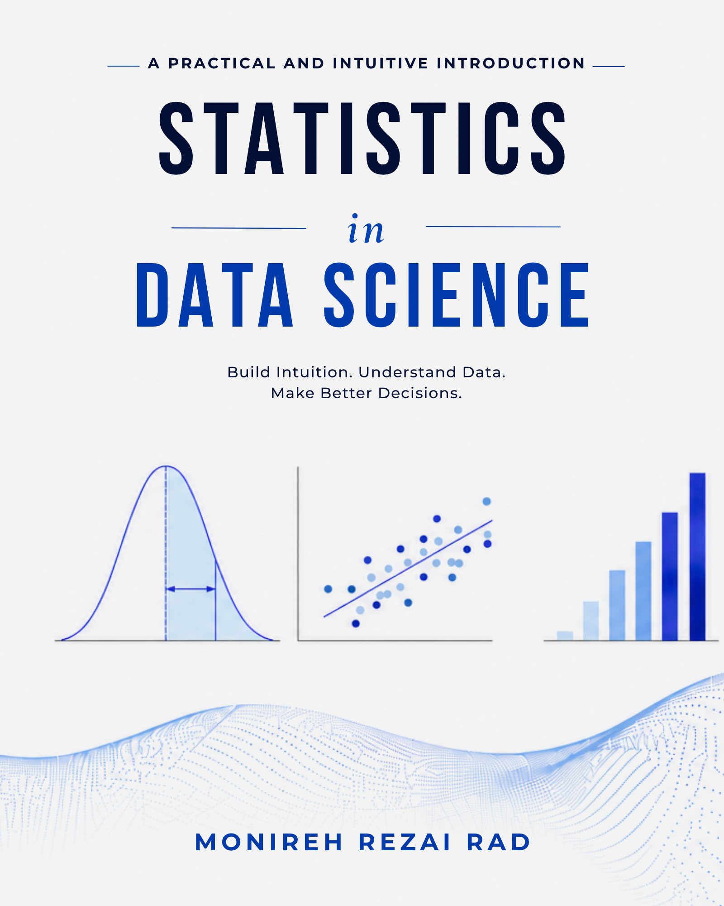

  

# Statistics in Data Science — Python and R Notebooks

This repository contains the companion Jupyter notebooks for the book:

**Statistics in Data Science (A Practical and Intuitive Introduction)**

The notebooks are designed to provide simple, intuitive, and hands-on Python and R examples that support the concepts introduced throughout the book.

---
Paperback: [Amazon](https://www.amazon.com/dp/B0H36RTZ3H)

PDF: [Payhip](https://payhip.com/b/UB6nq)

Repository: [Companion Notebooks](https://github.com/Monirehrad/Statistics-in-Data-Science-Notebooks)

# Topics Covered

- Describing and Understanding Data
- Important Probability Distributions
- Sampling and Statistical Inference
- Hypothesis Testing
- Proportions and ANOVA
- Confidence Intervals
- Statistical Power
- Linear Regression
- Regularization (Ridge and Lasso)
- Classification Models
- Categorical Variables and Encoding

---

# Repository Structure

Each chapter has its own folder containing:
- the chapter Python and R notebooks,
- and a short README description.

---

# Purpose of This Repository

The goal of these notebooks is to help students:
- build intuition,
- connect statistics with real-world data science,
- and practice concepts through clean and beginner-friendly Python and R examples.

---

Created by Monireh Rezai Rad
